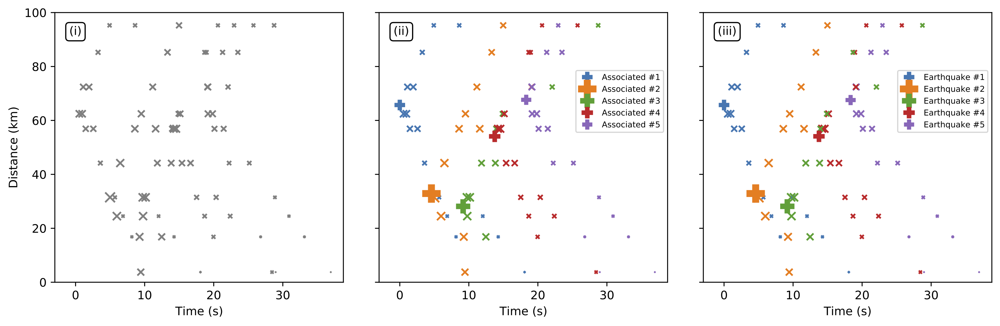
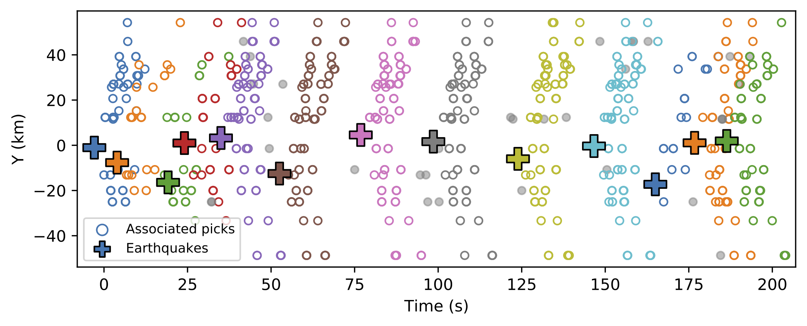

# *GaMMA*: *Ga*ussian *M*ixture *M*odel *A*ssociation 

## 1. Install
```bash
pip install gmma
```

## 2. Related papers:
- Zhu Weiqiang et al. Earthquake Phase Association using a Bayesian Gaussian Mixture Model (2021)


## 3. Examples:

- Synthetic Example

See details in the [notebook](): [example_synthetic.ipynb]()



- Real Example using PhaseNet picks

See details in the [notebook](): [example_phasenet.ipynb]()



